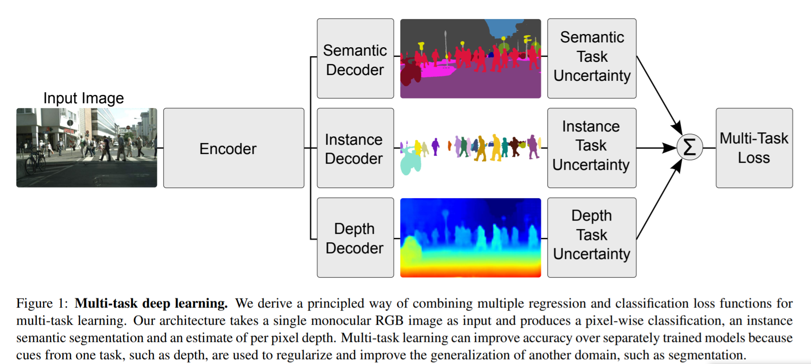

## Multi-Task Learning Using Uncertainty to Weigh Losses for Scene Geometry and Semantics

#### CVPR 2018

---

Alex Kendall1, Yarin Gal2, Roberto Cipolla1

1 University of Cambridge, 2 University of Oxford

---

## Resources

[Paper](https://arxiv.org/pdf/1705.07115.pdf)

[Code](https://github.com/yaringal/multi-task-learning-example)

[Alex Kendall's Homepage](https://alexgkendall.com/research/)

---

##  Objective

---

## Contributions

--

* a novel and principled multi-task loss to simultaneously learn various classification and regression losses of varying quantities and units using **homoscedastic** task uncertainty
* a unified architecture for semantic segmentation, instance segmentation and depth regression

* demonstrating the importance of loss weighting in multi-task deep learning and how to obtain superior performance compared to equivalent separately trained models.

---

#### Related Work 

---

<!-- .element height="70%" width="70%" -->

---

## Method

---

### Multi Task Learning with Homoscedastic Uncertainty
#### Homoscedastic uncertainty

--

#### Mtli-task likehoods 

--

## Scene Understanding Model

---

## Experiments

---

#### Data

---

## Conclusions

---

### Qualitative Results

<!-- .element height="70%" width="70%" -->

---

# Thank you! 
## Questions?
