## Multi-Task Learning Using Uncertainty to Weigh Losses for Scene Geometry and Semantics

#### CVPR 2018

---

Alex Kendall1, Yarin Gal2, Roberto Cipolla1

1 University of Cambridge, 2 University of Oxford

---

## Resources

[Paper](https://arxiv.org/pdf/1705.07115.pdf)

[Code](https://github.com/yaringal/multi-task-learning-example)

[Alex Kendall's Homepage](https://alexgkendall.com/research/)

---

##  Motivation

- Scene understanding algorithms must understand both the geometry and
semantics of the scene at the same time.

- Combining all tasks into a single model reduces computation and allows these systems to run in real-time.

--

- However:

  * Performance is highly dependent on an appropriate choice of weighting between each task’s loss

  * Tuning these weights by hand is a difficult and expensive process, making multi-task learning prohibitive in practice.
  
  * The optimal weighting of each task is dependent on the measurement scale (e.g. meters, centimetres or millimetres) and ultimately the magnitude of the task’s noise.

---

## Research Goals

---

- A model trained under multi-task learning can outperform separate models trained individually on each task:
  * Sematic Segmentation
  * Instance Segmentation
  * Depth Estimation

---

## Contributions

---

* A  multi-task loss to simultaneously learn various classification and regression losses of varying quantities and units using *homoscedastic* task uncertainty

* A unified architecture for semantic segmentation, instance segmentation and depth regression

* Demonstrating the importance of loss weighting in multi-task deep learning and how to obtain superior performance compared to equivalent separately trained models.

---

### Model Overview

<!-- .element height="100%" width="100%" -->

---

## Related Work

<!-- .element height="80%" width="80%" -->

---

## IDEAS

- Use homoscedastic uncertainty to weight the losses in multi-task learning models

---

#### Multi Task Learning with Homoscedastic Uncertainty

- Homoscedastic uncertainty
- Multi-task likehoods

---

#### Homoscedastic uncertainty

- In Bayesian modelling
  * *Epistemic Uncertainty*
  * Aleatoric Uncertainty
    * Data-dependent or  Heteroscedastic uncertainty
    * <mark>Task-dependent or Homoscedastic uncertainty </mark> 

---

- In a multi-task setting, the task uncertainty captures the relative confidence between tasks, reflecting the uncertainty inherent to the regression or classification task. 

---

#### Multi-task likehoods 

--

- Definations:
  - For regression task, Likelihood as a Gaussian with mean given by the model output, and an observation noise scalar σ:  
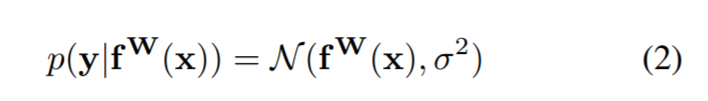<!-- .element height="65%" width="60%" -->

  - For classification:  
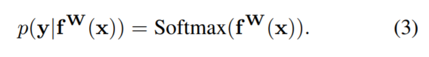<!-- .element height="70%" width="60%" -->

  - Multi-task likehood:  
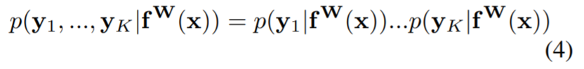<!-- .element height="60%" width="60%" -->

---

- Regression tasks' maximum likelihood inference

  - for Eq2, its written as  
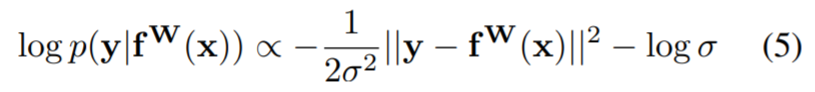<!-- .element height="60%" width="60%" -->

  - for multi-output:  
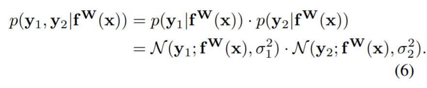<!-- .element height="50%" width="60%" -->

  - Leading to the *minimisation* objective:  
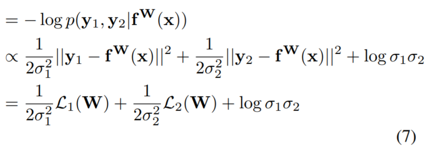<!-- .element height="50%" width="80%" -->

---

- Classification tasks' maximum likelihood inference

  - with a positive scalar σ. (Boltzmann distribution)  
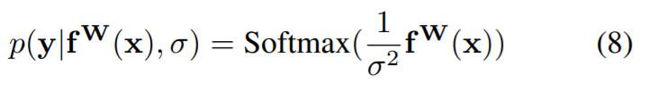<!-- .element height="70%" width="60%" -->

  - log likelihood  
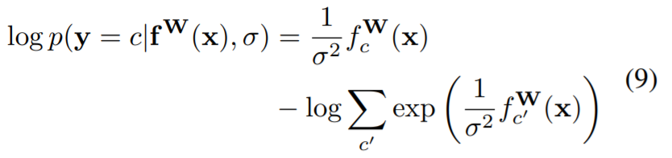<!-- .element height="25%" width="225%" -->

---

#### Loss function
- 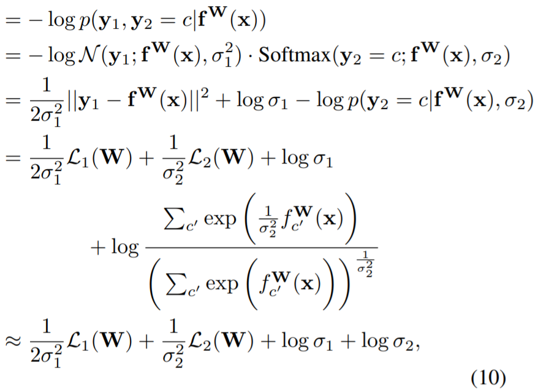<!-- .element height="100%" width="100%" -->

---

## Scene Understanding Model

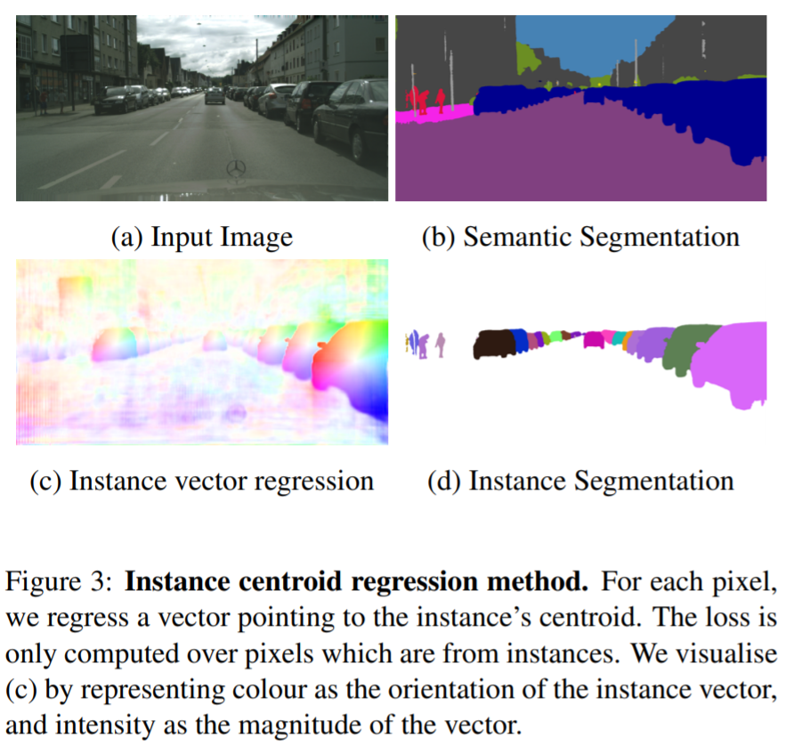<!-- .element height="10%" width="100%" -->

---

## Experiments

--

#### Dataset

- CItyScapes

---

### Quantitive Comparison

<!-- .element height="100%" width="100%" -->

---

### Ablation experiments

<!-- .element height="100%" width="100%" -->

---

### Qualitative Results

--

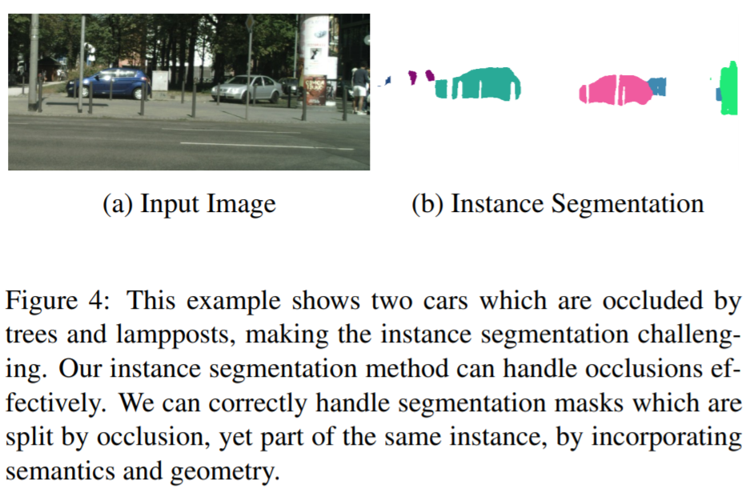<!-- .element height="80%" width="80%" -->

---

<!-- .element height="90%" width="90%" -->

---

# Thank you! 
## Questions?