## The Temporal Opportunist: Self-Supervised Multi-Frame Monocular Depth

#### CVPR 2021

---

Jamie Watson1, Oisin Mac Aodha2, Victor Prisacariu1,3, Gabriel Brostow1,4, Michael Firman1

1 Niantic, 2 University of Edinburgh,

3 University of Oxford,4 UCL

---

## Resources

[Paper](https://arxiv.org/pdf/2104.14540.pdf)

[Code](https://github.com/nianticlabs/manydepth)

---

## Background

- Structure from Motion (SfM)

- Self-supervised monocular depth estimation methods are trained using nearby frames as a supervision signal.

- At test time, a trained network can output a depth map from a single RGB image.

---

- However:

  * For some applications, sequence information is also available

  * The vast majority of monocular methods ingore this extra information.

  * Or use test-time refinement techniques or recurrent networks.

---

## Contributions

---

* A novel self-supervised multi-frame depth estimation model

* (For SfM) Showing moving objects and static scenes impact self-supervised multi-view matching approaches and introducing solutions

* An adaptive cost volume to overcome the scale ambiguity 

---

### Model Overview

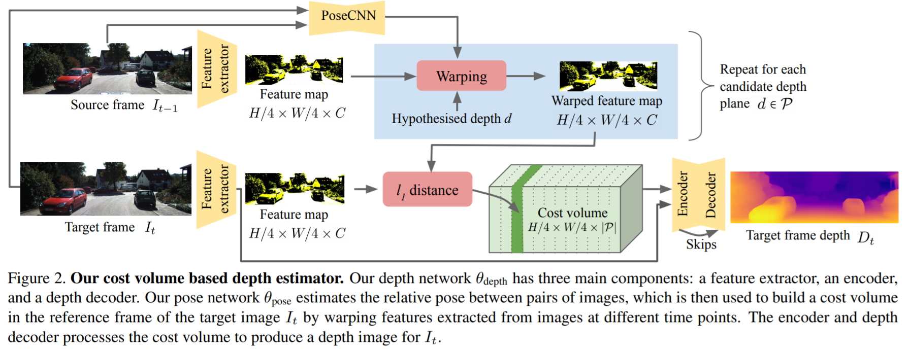<!-- .element height="100%" width="100%" -->

---

## Related Work

* Monocular depth estimation

* Multi-frames monocular depth estimation

* Deep multi-view depth estimation

---

## Comparison with other approaches 

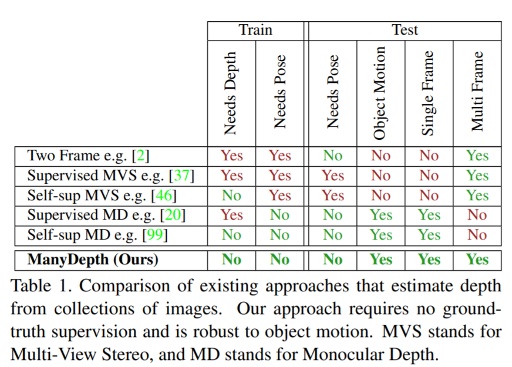<!-- .element height="80%" width="80%" -->

---

## Problem setup

* Single-image depth estimation
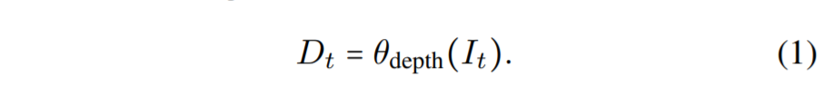<!-- .element height="70%" width="60%" -->

* Multi-frmae depth estimation
<!-- .element height="60%" width="60%" -->

---

## Methods

- self-supervised projection based training
- Multi-view cost volume:
- <mark>Adaptive cost volumes </mark>
- <mark>Addressing cost volume overfitting</mark>
- <mark>Static cameras and start of sequences</mark>

---

####  self-supervised projection based training

* Synthesized It:

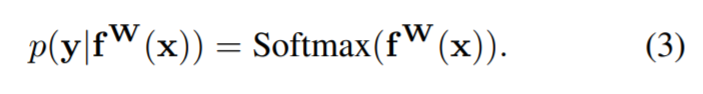<!-- .element height="70%" width="60%" -->

* Reconstruction Loss:

<!-- .element height="60%" width="60%" -->

---

####  multi-view cost volume

* A cost volume which measures the geometric compatibility at different depth values between pixels from frames. 

<!-- .element height="100%" width="100%" -->

---

#### How to build the cost volume

* For pixel(i,j), what is the likelihood of the correct depth being d, for each d in P?

---

#### However

* dmax and dmin are hyperparameters.

* One assumption: world is static 

---

####  <mark>Adaptive cost volumes </mark>

* dmax and dmin can be learned from Dt.

---

#### <mark>Addressing cost volume overfitting</mark>

---

##### Why failed?

* untextured regions
* Moiving objects (cars) 

---

##### Soluitions

* Using a seperate network to regularize

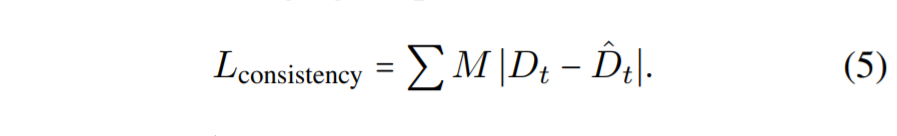<!-- .element height="70%" width="60%" -->

* Identifying unreliable pixels

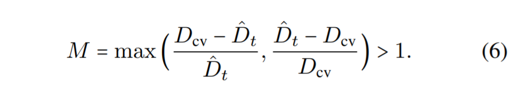<!-- .element height="60%" width="60%" -->

---

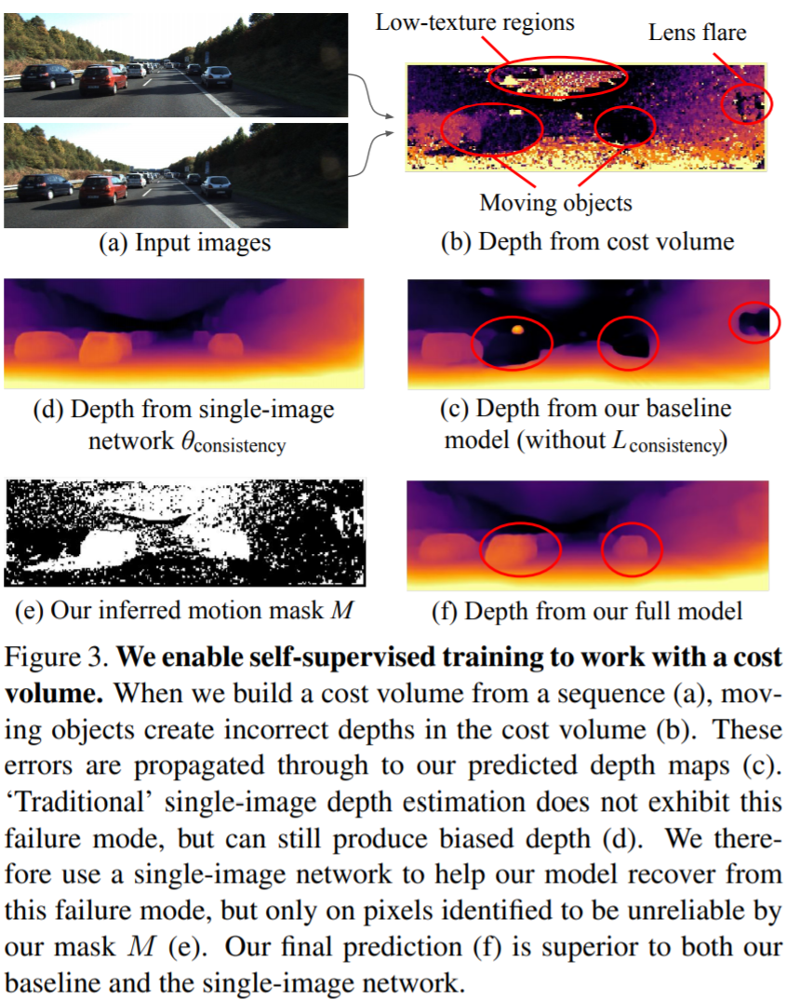<!-- .element height="100%" width="100%" -->

---

#### <mark>Static cameras and start of sequences</mark>

* Preceding frame does not exit

    * When training, with a probability p, set the cost volume to zero.
    * At testing, same processing

---

* Camera does not move

* With a probability q, replace It-1 with It in a color augmented version

%#### Loss function

%- 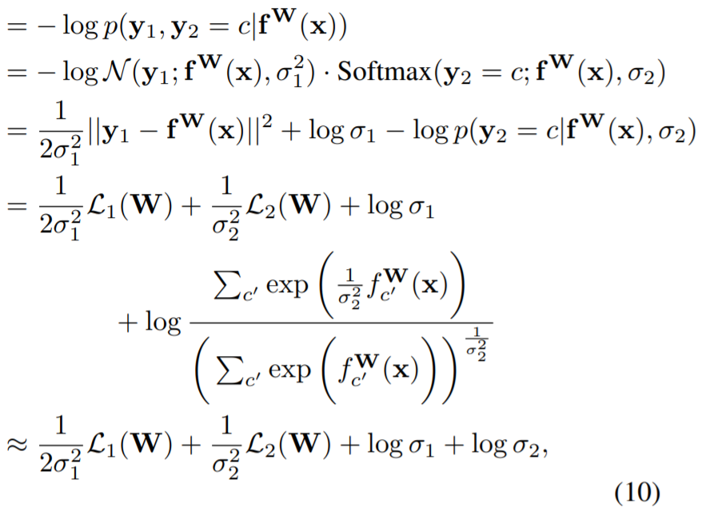<!-- .element height="100%" width="100%" -->

---

## Experiments

---

#### Dataset

- KITTI
- CityScapes

---

### Quantitive Comparison

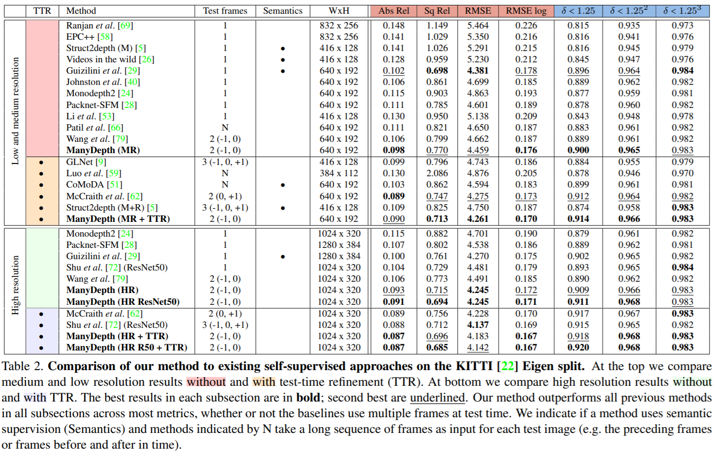<!-- .element height="100%" width="100%" -->

---

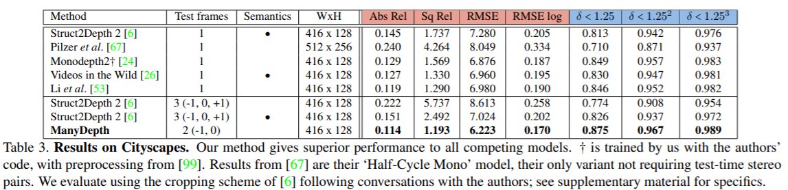<!-- .element height="100%" width="100%" -->

---

### Efficiency comparison

* Mutiply-add computations(MACS)

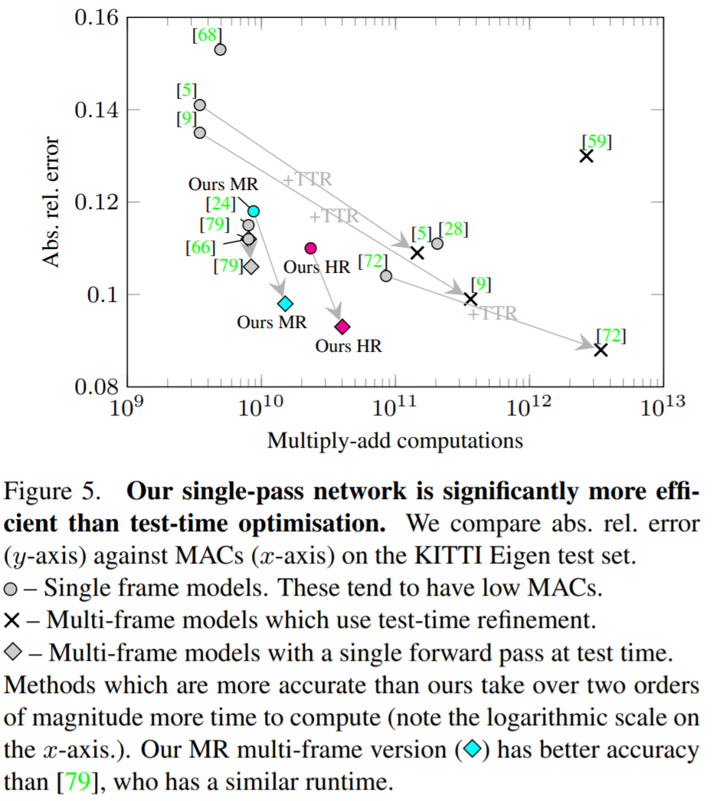<!-- .element height="100%" width="60%" -->

---

### Ablation experiments

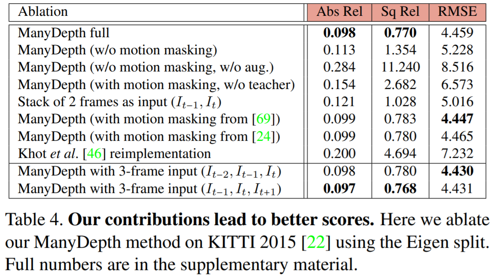<!-- .element height="100%" width="100%" -->

---

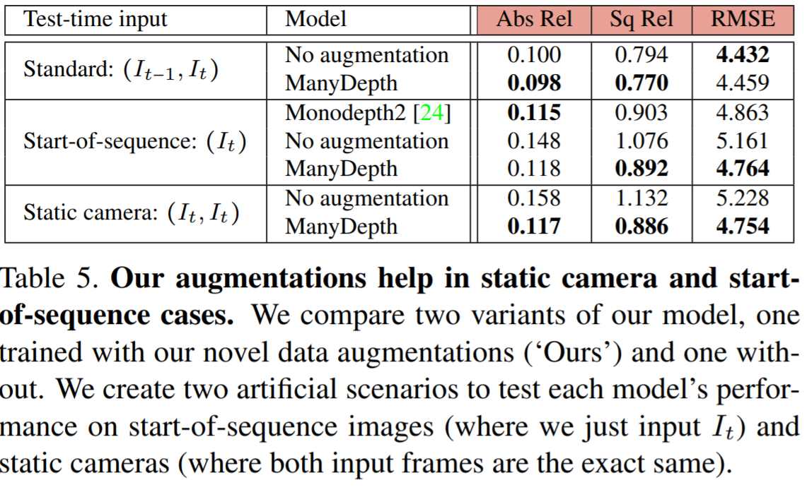<!-- .element height="100%" width="100%" -->

---

### Qualitative Results

---

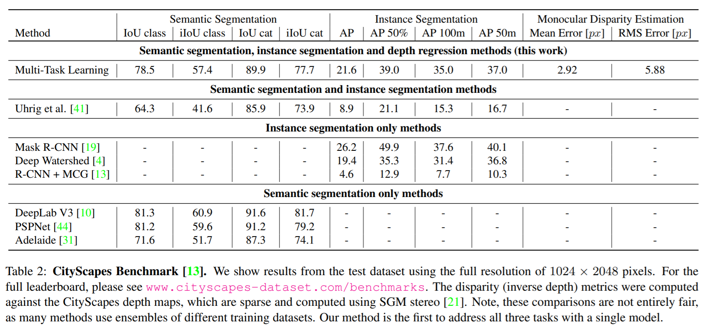<!-- .element height="100%" width="100%" -->

---

# Thank you! 

## Questions?
