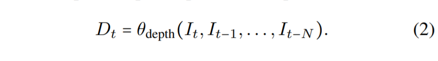
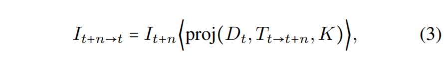
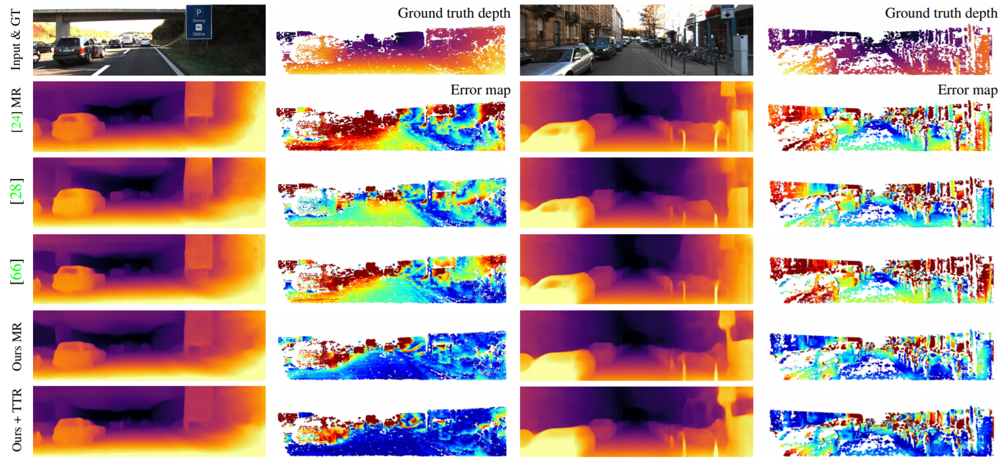

## The Temporal Opportunist: Self-Supervised Multi-Frame Monocular Depth

#### CVPR 2021

---

Jamie Watson1, Oisin Mac Aodha2, Victor Prisacariu1,3, Gabriel Brostow1,4, Michael Firman1

1 Niantic, 2 University of Edinburgh,

3 University of Oxford,4 UCL

---

## Resources

[Paper](https://arxiv.org/pdf/2104.14540.pdf)

[Code](https://github.com/nianticlabs/manydepth)

---

## Background

- Self-supervised monocular depth estimation methods are trained using nearby frames as a supervision signal.

- At test time, a trained network can output a depth map from a single RGB image.

--

- However:

  * For some applications, sequence information is also available

  * The vast majority of monocular methods ingore this extra information.

  * Or use test-time refinement techniques or recurrent networks.

---

## Contributions

---

* A novel self-supervised multi-frame depth estimation model

* Showing moving objects and static scenes impact self-supervised multi-view matching approaches and introduce solutions

* An adaptive cost volume to overcome the scale ambiguity 

---

### Model Overview

<!-- .element height="100%" width="100%" -->

---

## Related Work

* Monocular depth estimation

* Multi-frames monocular depth estimation

* Deep multi-view depth estimation

---

<!-- .element height="80%" width="80%" -->

---

## Problem setup

<!-- .element height="70%" width="60%" -->

<!-- .element height="60%" width="60%" -->

---

## Methods

- self-supervised projection based training
- Multi-view cost volume:
- <mark>Adaptive cost volumes </mark>
- <mark>Addressing cost volume overfitting</mark>
- <mark>Static cameras and start of sequences</mark>

---

####  self-supervised projection based training

<!-- .element height="70%" width="60%" -->

<!-- .element height="60%" width="60%" -->

---

####  multi-view cost volume

<!-- .element height="100%" width="100%" -->

---

####  <mark>Adaptive cost volumes </mark>

---

#### <mark>Addressing cost volume overfitting</mark>

<!-- .element height="70%" width="60%" -->

<!-- .element height="60%" width="60%" -->

---

#### <mark>Static cameras and start of sequences</mark>

<!-- .element height="100%" width="100%" -->

---

#### Loss function
- <!-- .element height="100%" width="100%" -->

---

## Experiments

--

#### Dataset

- KITTI
- CityScapes

---

### Quantitive Comparison

<!-- .element height="100%" width="100%" -->

---

<!-- .element height="100%" width="100%" -->

---

### Efficiency comparison

<!-- .element height="100%" width="60%" -->

---

### Ablation experiments

<!-- .element height="100%" width="100%" -->

--

<!-- .element height="100%" width="100%" -->

---

### Qualitative Results

--

<!-- .element height="100%" width="100%" -->

---

# Thank you! 

## Questions?
